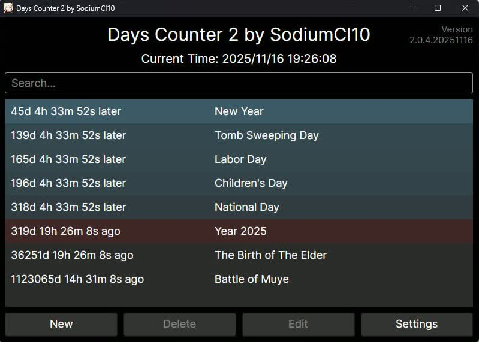

# Days Counter 2

> It is a great honor to invite you to translate this software using Crowdin: https://crowdin.com/project/dayscounter2

Welcome to use Days Counter 2 by SodiumCl10, aka. [Ace-tyl](https://github.com/Ace-tyl).

This software is a days counter timer which can count the time between a past or upcoming event and the present, accurate to second.

## Usage

### Installation

First, download the latest release from the [Releases](https://github.com/Ace-tyl/DaysCounter2/releases) page.

For Windows users, extract **all** files from the downloaded zip file to the **same** folder. Double-click the `DaysCounter2.exe` to run.

For Linux and macOS users, extract **all** files from the downloaded zip file to the **same** folder. Execute `chmod +x path/to/your/DaysCounter2` then double-click the `DaysCounter2` to run.

### Adding Events

To add your first event, click the **New** button, and an event editor window appears. Input your event name and set your event datetime. You can also set your event time zone if the event occurred / will occur in another time zone.

If necessary, check the **Loop** checkbox and you can set a loop time to your event. When time passed an event with loop time set, the set loop time will be automatically added to event time. This can be used when you want to countdown to (including but not limited to):

* Weekends
* Anniversaries such as your birthday
* Festivals such as New Year

After editing, click the **Save** button to save your edit. If you want to discard your edit, just close the editor window.

### Editing or Deleting Events

To edit an event, select the event and click the **Edit** button. The event editor window appears with the event information filled in, and you can start edit this event as described in *Adding Events*.

To delete an event, select the event and click the **Delete** button. You can also select multiple events. This step is irrevocable, so be cautious! Note that when you select multiple (at least 2) events, the timer refreshing will be paused until you deselect them or delete them.

The operation to events list (adding, editing, deleting) is saved at once, so the events can be automatically loaded the next time you start this program.

### Event Date

The event date can be set to a wide range, from 4713 BC to 9999 AD. The date is subject to the current Gregorian calendar by default, which was revised by Pope Gregory XIII in 1582 based on the existing Julian calendar. Specifically, the date is calculated as the following rules:

* After Oct 15, 1582 (inclusive): The Gregorian calendar is applied, with 31 days in January, 28 or 29 days in February, 31 days in March, 30 days in April, 31 days in May, 30 days in June, 31 days in July, 31 days in August, 30 days in September, 31 days in October, 30 days in November, and 31 days in December. Among them, February has 29 days in leap years and 28 days in common years. A year is considered a leap year if it is a multiple of 400, or if it is a multiple of 4 but not a multiple of 100.
* From Oct 5, 1582 to Oct 14, 1582 (inclusive): These dates do not exist and have been omitted. After Oct 4 of that year, the date becomes Oct 15.
* Before Oct 4, 1582 (inclusive): The Julian calendar is applied, with the same number of days in each month as the Gregorian calendar, but a year is considered a leap year only if it is a multiple of 4.
* Although the Julian calendar was only implemented in 45 BC and underwent several adjustments in its early stages, today humans are accustomed to using the final rules of the Julian calendar to deduce all dates before Oct 4, 1582. Note that the year 0 AD does not exist; that is, the year following 1 BC is 1 AD. Therefore, years such as 1 BC, 5 BC, 9 BC, 13 BC, and so on should be considered leap years.

When entering a year before the Common Era such as x BC, the number -(x - 1) is required to input. For example, Emperor Qin Shi Huang unified the six states in 221 BC, so the Year value should be set to -220 in order to add this event. A prompt will be displayed if you input a year before the Common Era (non-positive).

In addition, the Chinese Lunisolar calendar and the Al-Hijri calendar (Islamic calendar) are also supported to determine the event date.

The implementation of Chinese Lunisolar calendar referred to [liujiawm/php-calendar](https://github.com/liujiawm/php-calendar), which uses astronomical calculation methods to estimate the calendar instead of lookup table, so that the supported date range is as wide as using the Gregorian calendar. To input a date with leap month (闰月 in Chinese), input 0 as month (no matter what leap month it is this month). Note that the calculation method only guarantees accuracy between year -999 (1000 BC) to 3000. For years outside this range, the calendar can still be used but we cannot guarantee complete accuracy.

The Al-Hijri calendar is using 30-year cycle tabular, and may be a 1-day discrepancy with the Umm-al-Qura calendar used by Saudi Arabia.

### Searching for Events

To search some events you have added to events list, you can type your searching string in the search box and all events containing this string will be displayed.

Furthermore, you can also use [regular expressions](https://en.wikipedia.org/wiki/Regular_expression) in the search box to make a more customized search. For example, you can type `^\d` in the search box to search for events with name beginning with a digit.

### Customization

To customize this application, click the **Settings** button. The following properties can be customized:

* **Language**: Controls the display language of the software, default is English (United States). Supported languages:

  * English (United States)
  * Simplified Chinese (Chinese Mainland)
  * Arabic (Saudi Arabia)
  * Japanese (Japan)
  * Korean (Republic of Korea)
  * Russian (Russia)
  * Swedish (Sweden)
  * Traditional Chinese (Hong Kong SAR)
  * Traditional Chinese (Chinese Taiwan)

* **Date Time Format**: Controls the format of date time shown as the current time and destination time, default is `yyyy-MM-dd HH:mm:ss`.

  * Date time earlier than Jan 1, 1600 0:00:00 UTC or later than Dec 31, 9999 0:00:00 UTC can't get displayed and will shown as Beyond Display Range, since the incompatibility of our Date Time module with the system Date Time module of C#.

* **Background Color**: Controls the background color of an event item. 3 configurable colors as follows:

  * *Future*: The color of upcoming events, default is #66CCFF with opacity 160.
  * *Past*: The color of events that have already passed, default is #EE0000 with opacity 160.
  * *Distant*: The color of distant events, including distant future and distant past, default is transparent.

  The color of an event will be interpolated between *Future/Past* and *Distant*, according to the timer.
  
* **Show Destination Time**: Controls whether the program shows the destination time of an event on the main window, or only shows the destination time of future events. Default is to always show.

* **Display Font**: Controls the display font of program, which means you can use your own font instead of the default font of Avalonia.

## Credits

This project is based on [.NET 8](https://dotnet.microsoft.com/) and [Avalonia UI](https://avaloniaui.net/), and is packaged by [Costura.Fody](https://github.com/Fody/Costura).

Other NuGet packages used:

* [MessageBox.Avalonia](https://github.com/CreateLab/MessageBox.Avalonia)
* [AvaloniaColorPicker](https://github.com/arklumpus/AvaloniaColorPicker)

The icon of the software is [Chisato Nishikigi (錦木 千束)](https://en.wikipedia.org/wiki/Chisato_Nishikigi) from [Lycoris Recoil](https://en.wikipedia.org/wiki/Lycoris_Recoil).
